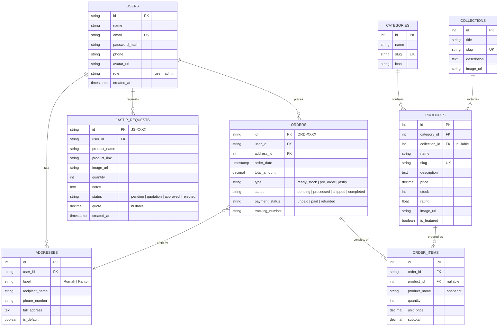

# Entity Relationship Diagram (ERD) - Modern Store

Dokumen ini menjelaskan struktur data dan hubungan antar entitas dalam aplikasi Modern Store.

## 1. Diagram ERD (Mermaid)

---

## 2. Definisi Entitas

### 2.1 USERS
Menyimpan informasi pengguna aplikasi, baik pembeli maupun administrator.
- `role`: Membedakan akses antara pengguna biasa dan admin dashboard.

### 2.2 ADDRESSES
Daftar alamat pengiriman yang disimpan oleh pengguna.
- Satu pengguna dapat memiliki banyak alamat (Rumah, Kantor, dll).
- `is_default`: Menandai alamat utama untuk checkout.

### 2.3 CATEGORIES
Kategori produk (misal: Sepatu, Pakaian, Aksesori).
- Digunakan untuk navigasi dan filter produk di halaman Shop.

### 2.4 COLLECTIONS
Grup produk berdasarkan tema tertentu (misal: "Edisi 01: Esensial Modern").
- Memiliki halaman detail tersendiri untuk menampilkan kurasi produk.

### 2.5 PRODUCTS
Katalog produk yang tersedia di toko.
- `stock`: Melacak ketersediaan barang.
- `collection_id`: Opsional, produk bisa saja tidak masuk ke koleksi tertentu.

### 2.6 ORDERS
Informasi utama transaksi pembelian.
- `id`: Menggunakan format khusus (misal: ORD-9921).
- `type`: Membedakan pesanan barang stok, pre-order, atau hasil jastip.

### 2.7 ORDER_ITEMS
Detail barang yang dibeli dalam satu pesanan.
- Menyimpan `product_name` dan `unit_price` saat transaksi untuk riwayat (mencegah data berubah jika produk asli diupdate).

### 2.8 JASTIP_REQUESTS
Permintaan khusus pengguna untuk barang yang tidak ada di katalog (Personal Shopper).
- Admin akan memberikan `quote` (penawaran harga) berdasarkan request ini.
- Jika disetujui, dapat dikonversi menjadi `ORDERS`.

---

## 3. Hubungan (Relationships)

1.  **Users - Addresses (1:N)**: Satu user bisa punya banyak alamat simpanan.
2.  **Users - Orders (1:N)**: Satu user bisa melakukan banyak pesanan.
3.  **Users - JastipRequests (1:N)**: Satu user bisa mengajukan banyak permintaan titipan.
4.  **Categories - Products (1:N)**: Satu kategori berisi banyak produk.
5.  **Collections - Products (1:N)**: Satu koleksi membawahi banyak produk.
6.  **Orders - OrderItems (1:N)**: Satu pesanan terdiri dari satu atau lebih item barang.
7.  **Orders - Addresses (N:1)**: Pesanan dikirim ke satu alamat spesifik milik user.
8.  **Products - OrderItems (1:N)**: Satu produk bisa muncul di banyak detail pesanan.

---

## 4. Analisis Kebutuhan Data Tambahan (Berdasarkan UI Spec & PRD)

Berdasarkan analisis terbaru, terdapat beberapa kebutuhan data yang perlu diakomodasi dalam schema database di masa mendatang:

### 4.1 Manajemen User & Profil
*   **Update Profile**: Perlu memastikan field `avatar_url`, `phone`, dan `name` pada tabel `USERS` dapat diupdate secara parsial.
*   **Update & Delete Alamat**: Tabel `ADDRESSES` sudah mendukung ID, sehingga tinggal mengimplementasikan logic soft-delete atau hard-delete.
*   **Ganti Password**: Keamanan kredensial pada tabel `USERS`.

### 4.2 Manajemen Produk (Admin & Umum)
*   **Status Produk**: Penambahan field `status` (active, inactive, archived) pada tabel `PRODUCTS`.
*   **Riwayat Stok**: Perlu tabel baru `STOCK_LOGS` untuk mencatat perubahan stok (qty_before, qty_after, change_type, reason, admin_id).
*   **Daftar Koleksi**: Tabel `COLLECTIONS` sudah ada, namun perlu dipastikan API-nya tersedia untuk umum.

### 4.3 Alur Transaksi & Pembayaran
*   **Ongkir**: Perlu field `shipping_cost` dan `courier_service` pada tabel `ORDERS`.
*   **Bukti Transfer**: Penambahan field `payment_proof_url` pada tabel `ORDERS` untuk menampung link gambar bukti bayar manual.
*   **Konfirmasi Admin**: Field `verified_at` atau `verified_by` pada tabel `ORDERS` untuk tracking validasi pembayaran.

### 4.4 Alur Jastip & Pre-Order
*   **Konversi ke PO**: Logic untuk menyalin data dari `JASTIP_REQUESTS` ke `PRODUCTS` (dengan flag `is_preorder`).
*   **Request Pre-Order**: Tabel baru `PREORDER_REQUESTS` untuk mencatat minat user saat stok produk habis.

### 4.5 Fitur Pendukung Lainnya
*   **Sistem Notifikasi**: Tabel baru `NOTIFICATIONS` (user_id, title, message, type, is_read, created_at).
*   **Filter Harga**: Optimization pada query `PRODUCTS` untuk filter `price` range.
